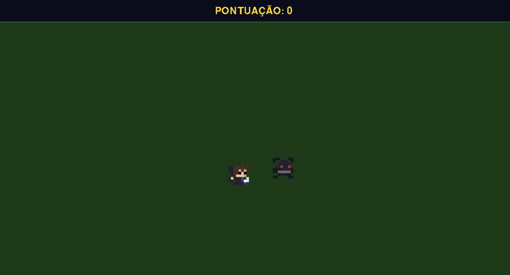

# Pixel Shooter



A 2D pixel art shooter developed with Python and Pygame. The player faces waves of enemies that spawn from the edges of the map and must be eliminated before they reach them. Difficulty increases progressively over time.

---

## Technical Specifications

| Item | Value |
|---|---|
| Language | Python 3 |
| Library | Pygame |
| Resolution | 1200 × 650 px |
| Map size | 200 × 100 units (6× scale) |
| Sprite size | 8 × 8 px (48 × 48 on screen) |
| Target FPS | 60 |

### Game Parameters

| Parameter | Value |
|---|---|
| Player speed | 60 units/s |
| Projectile speed | 220 units/s |
| Shoot cooldown | 0.5 s |
| Enemy speed | 28 units/s |
| Initial spawn interval | 5.0 s |
| Minimum spawn interval | 0.8 s |
| Spawn reduction factor | 0.93× per enemy |

### Project Structure

```
implementacao-primeiro-jogo/
├── game.py           # Main source code
└── assets/
    ├── player.png        # Player sprite
    ├── enemy01.png       # Enemy sprite
    ├── splash-art.png    # Game art
    ├── sound-start.mp3   # Match start sound
    ├── sound-laser.mp3   # Shoot sound
    └── sound-game-over.mp3  # Game over sound
```

---

## How to Run

### Prerequisites

- Python 3.8 or higher
- pip

### Installation

```bash
# Clone the repository
git clone <repository-url>
cd implementacao-primeiro-jogo

# Install the dependency
pip install pygame
```

### Running the Game

```bash
python game.py
```

---

## Controls

| Key | Action |
|---|---|
| `W` `A` `S` `D` | Move the player |
| `↑` `↓` `←` `→` | Shoot in 4 directions |

---

## Mechanics

- **Progressive spawn** — enemies spawn from the edges of the map and the spawn frequency increases with each new enemy generated.
- **Collision** — an enemy that touches the player ends the match.
- **Score** — each eliminated enemy is worth 1 point.
- **Screens** — Menu → Game → Game Over → Menu.
